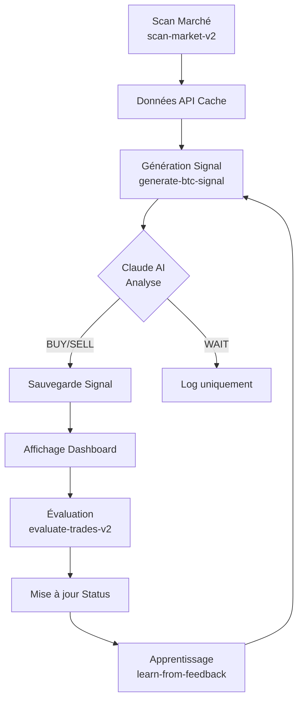

# 🤖 GUIDE COMPLET : GÉNÉRATION DE SIGNAUX PAR L'IA

## 📊 FLUX COMPLET DE GÉNÉRATION

### 1️⃣ SCAN DU MARCHÉ (scan-market-v2)

**Fonction** : `scan-market-v2`
**Fréquence** : Toutes les 10 minutes (via cron job)
**Objectif** : Récupérer données de marché BTC & ETH depuis APIs externes

#### APIs Utilisées :
- **CoinGecko** : Prix, volume 24h, variation, market cap
- **CoinMarketCap** : Dominance du marché
- **CryptoPanic** : News & sentiment (bullish/bearish/neutral)
- **Santiment** : Données on-chain (adresses actives, volume social)

#### Données Collectées :
```json
{
  "market": {
    "price": 68234.50,
    "change24h": 2.45,
    "volume24h": 28500000000,
    "high24h": 69000.00,
    "low24h": 67500.00,
    "dominance": 45.2
  },
  "news": {
    "sentiment": "bullish",
    "count": 15,
    "headlines": ["Bitcoin atteint 70K...", "Adoption institutionnelle..."]
  }
}
```

#### Stockage :
- Table : `api_cache`
- Clé : `scan_market_btc` / `scan_market_eth`
- Durée : 10 minutes

---

### 2️⃣ GÉNÉRATION DU SIGNAL BTC (generate-btc-signal)

**Fonction** : `generate-btc-signal`
**Modèle IA** : `claude-3-5-sonnet-20241022`
**Tokens max** : 2000
**Objectif** : Analyser données et générer signal BUY/SELL/WAIT

#### PROMPT COMPLET ENVOYÉ À CLAUDE AI :

```plaintext
Tu es un analyste crypto professionnel spécialisé en BTCUSDT.

Analyse le marché du Bitcoin sur plusieurs horizons de temps (1h, 4h, 1j)
en tenant compte des aspects techniques, fondamentaux, on-chain et du sentiment global.

Voici les données actuelles :

Données de marché :
{
  "price": 68234.50,
  "change_24h": 2.45,
  "volume_24h": 28500000000,
  "high_24h": 69000.00,
  "low_24h": 67500.00,
  "reputation": 65.30,
  "success_rate": 58.20,
  "dominance": 45.20,
  "btc_funding_rate": 0.0100
}

Indicateurs techniques :
{
  "rsi": 62.50,
  "macd": 24.50,
  "macd_histogram": 7.35,
  "ema20": 67552.00,
  "ema50": 66869.00,
  "ema200": 64822.00,
  "volume_ratio": 1.20,
  "price_change_1h": 0.98,
  "price_change_4h": 1.72,
  "trend_strength": 4.90
}

Données de sentiment et fondamentales :
{
  "market_sentiment": "bullish",
  "news_count": 15,
  "onchain_active_addresses": "N/A",
  "onchain_transaction_volume": "N/A",
  "social_volume": "N/A",
  "fear_greed_index": 50
}

Profil de risque utilisateur :
{
  "risk_level": "modéré",
  "position_size_pct": 5
}

Consignes de décision :
- Utilise les données ci-dessus pour déterminer la tendance dominante.
- Compare les horizons de temps (1h, 4h, 1j) pour détecter la cohérence.
- Génère un seul signal principal basé sur les probabilités les plus fortes.
- Si la confiance est < 65, réponds toujours WAIT.
- Prends en compte le niveau de réputation pour ajuster la taille des TP et SL.
- N'invente rien : base-toi uniquement sur les données données.

Retourne ta réponse **strictement au format JSON** (sans markdown, sans backticks) :

{
  "symbol": "BTCUSDT",
  "signal_type": "BUY" | "SELL" | "WAIT",
  "confidence": <nombre 0-100>,
  "entry_price": 68234.50,
  "take_profit": <nombre>,
  "stop_loss": <nombre>,
  "horizon_minutes": 240,
  "position_size_pct": 5,
  "reason": {
    "explain": "<explication concise en français sur la logique de la décision>",
    "indicators": ["RSI", "MACD", "EMA20/50/200", "sentiment", "volume", "price action"]
  }
}
```

#### RÉPONSE TYPE DE CLAUDE AI :

```json
{
  "symbol": "BTCUSDT",
  "signal_type": "BUY",
  "confidence": 72,
  "entry_price": 68234.50,
  "take_profit": 70200.00,
  "stop_loss": 67100.00,
  "horizon_minutes": 240,
  "position_size_pct": 5,
  "reason": {
    "explain": "Le RSI à 62.5 indique une zone d'achat saine sans surachat. Le MACD montre un momentum haussier avec histogram positif. Les EMAs sont alignées (20>50>200), confirmant une tendance haussière forte sur plusieurs timeframes. Le sentiment bullish et le volume 20% au-dessus de la moyenne supportent la continuation de la hausse.",
    "indicators": ["RSI", "MACD", "EMA20/50/200", "sentiment", "volume", "price action"]
  }
}
```

---

### 3️⃣ SAUVEGARDE DU SIGNAL

#### Conditions de Sauvegarde :
- ✅ **Si BUY ou SELL** → Sauvegarde dans `crypto_signals`
- ❌ **Si WAIT** → Pas de sauvegarde (logging uniquement)

#### Données Sauvegardées :
```sql
INSERT INTO crypto_signals (
  symbol,
  signal_type,
  confidence,
  entry_price,
  take_profit,
  stop_loss,
  horizon_minutes,
  reason,
  status,
  created_at
) VALUES (
  'BTCUSDT',
  'BUY',
  72,
  68234.50,
  70200.00,
  67100.00,
  240,
  '{"explain": "...", "indicators": [...]}',
  'active',
  NOW()
);
```

---

### 4️⃣ AFFICHAGE EN TEMPS RÉEL

#### Dashboard (Page Accueil)
- **Composant** : `LiveSignals.jsx`
- **Source** : Table `crypto_signals` WHERE status = 'active'
- **Tri** : Par date (DESC)
- **Limite** : 10 derniers signaux

#### Analyse Live (Page Analyse)
- **Composant** : `AnalysisLivePage.jsx`
- **Statistiques** : BUY actifs, SELL actifs, confiance moyenne
- **Détails complets** : Entrée, TP, SL, confiance, raison

---

### 5️⃣ ÉVALUATION DES SIGNAUX (evaluate-trades-v2)

**Fonction** : `evaluate-trades-v2`
**Fréquence** : Toutes les heures
**Objectif** : Évaluer si TP ou SL atteints

#### Logique d'Évaluation :

**Pour BUY** :
```javascript
if (currentPrice >= takeProfit) {
  result = 'WIN'
  exitPrice = takeProfit
  profitPct = ((takeProfit - entryPrice) / entryPrice) * 100
}
else if (currentPrice <= stopLoss) {
  result = 'LOSS'
  exitPrice = stopLoss
  profitPct = ((stopLoss - entryPrice) / entryPrice) * 100
}
```

**Pour SELL** :
```javascript
if (currentPrice <= takeProfit) {
  result = 'WIN'
  exitPrice = takeProfit
  profitPct = ((entryPrice - takeProfit) / entryPrice) * 100
}
else if (currentPrice >= stopLoss) {
  result = 'LOSS'
  exitPrice = stopLoss
  profitPct = ((entryPrice - stopLoss) / entryPrice) * 100
}
```

#### Mise à Jour :
```sql
UPDATE crypto_signals
SET
  status = 'completed', -- ou 'failed'
  evaluated_at = NOW()
WHERE id = <signal_id>;

INSERT INTO trade_feedback (
  signal_id,
  symbol,
  result,
  pnl_percent,
  is_manual_feedback
) VALUES (...);
```

---

### 6️⃣ APPRENTISSAGE CONTINU (learn-from-feedback)

**Fonction** : `learn-from-feedback`
**Modèle IA** : `claude-3-5-sonnet-20241022`
**Fréquence** : Hebdomadaire
**Objectif** : Analyser performances et générer recommandations

#### Analyse des 30 Derniers Jours :
```javascript
{
  total_feedback: 120,
  successful: 72,
  failed: 48,
  total_profit_loss: +$4,250.00,
  win_rate: 60%,

  by_symbol: {
    BTCUSDT: { count: 80, wins: 50, losses: 30, total_pl: +$3,200 },
    ETHUSDT: { count: 40, wins: 22, losses: 18, total_pl: +$1,050 }
  }
}
```

#### Recommandations Claude AI :
```json
{
  "overall_assessment": "Les performances sont solides avec un taux de réussite de 60%. BTC surperforme ETH.",
  "recommendations": [
    "Augmenter légèrement le seuil de confiance minimum de 65% à 70%",
    "Privilégier les signaux BTC qui montrent une meilleure consistance",
    "Ajuster les stop-loss sur ETH pour réduire les pertes moyennes"
  ],
  "strategy_adjustments": {
    "confidence_minimum": "70%",
    "symbols_to_favor": ["BTCUSDT"],
    "symbols_to_avoid": []
  }
}
```

---

## 🎯 RÉSUMÉ DU PROCESSUS



---

## 📌 POINTS CLÉS

### ✅ AVANTAGES DU SYSTÈME

1. **Multi-source** : 4 APIs différentes pour données complètes
2. **IA Avancée** : Claude 3.5 Sonnet (meilleur modèle disponible)
3. **Prompt Structuré** : 20+ champs de données analysés
4. **Confiance Minimum** : 65% pour éviter signaux faibles
5. **Apprentissage Continu** : Amélioration basée sur performances réelles
6. **Temps Réel** : Signaux affichés instantanément via Supabase Realtime

### ⚙️ CONFIGURATION

- **Modèle** : claude-3-5-sonnet-20241022
- **Tokens** : 2000 max
- **Timeout** : 30s par requête
- **Retry** : 3 tentatives avec backoff
- **Cache** : 10 minutes pour données marché
- **Évaluation** : Toutes les heures
- **Learning** : Hebdomadaire

---

## 🚀 PROCHAINES AMÉLIORATIONS

1. **Plus d'indicateurs techniques** : Bollinger Bands, Stochastic, Fibonacci
2. **Sentiment Twitter/Reddit** : Analyse réseaux sociaux temps réel
3. **ML Pattern Recognition** : Détection patterns chartistes automatique
4. **Multi-timeframe** : Signaux séparés 1h/4h/1d
5. **Portfolio Optimization** : Suggestions allocation capital
